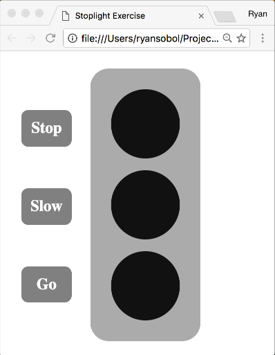

# Stoplight Exercise

As always, fork and clone this repository.

## Part 1

Add DOM event listeners to toggle the on/off state of three bulbs.

- When a user clicks on the "Stop" button, toggle the top bulb's color to `red`.
- When a user clicks on the "Slow" button, toggle the middle bulb's color to `orange`.
- When a user clicks on the "Go" button, toggle the bottom bulb's color to `green`.

**TIP**: All three bulbs can be on/off independently of one another.

### Resources

- [MDN - `Document.querySelector()`](https://developer.mozilla.org/en-US/docs/Web/API/Document/querySelector)
- [MDN - `EventTarget.addEventListener()`](https://developer.mozilla.org/en-US/docs/Web/API/EventTarget/addEventListener)
- [MDN - `click`](https://developer.mozilla.org/en-US/docs/Web/Events/click)
- [MDN -  `background-color`](https://developer.mozilla.org/en-US/docs/Web/CSS/background-color)

## Part 2

Add new DOM event listeners to log the mouse state of each button.

- When a user's mouse enters a button, log `"Entered <textContent> button"` to the console.
- When a user's mouse leaves a button, log `"Left <textContent> button"` to the console.

**TIP:** Each event type will need a separate event listener.

### Resources

- [MDN - `mouseenter`](https://developer.mozilla.org/en-US/docs/Web/Events/mouseenter)
- [MDN - `mouseleave`](https://developer.mozilla.org/en-US/docs/Web/Events/mouseleave)
- [MDN - `Event.target`](https://developer.mozilla.org/en-US/docs/Web/API/Event/target)

## Bonus

Add **one** new DOM event listener to log the state of each bulb.

- When a user clicks a button that just turned on, log`"<textContent> bulb on"` to the console.
- When a user clicks a button that just turned off, log`"<textContent> bulb off"` to the console.

**TIP:** A click on only a button should cause a message to be logged to the console.

### Resources

- [How JavaScript Event Delegation Works](https://davidwalsh.name/event-delegate)
